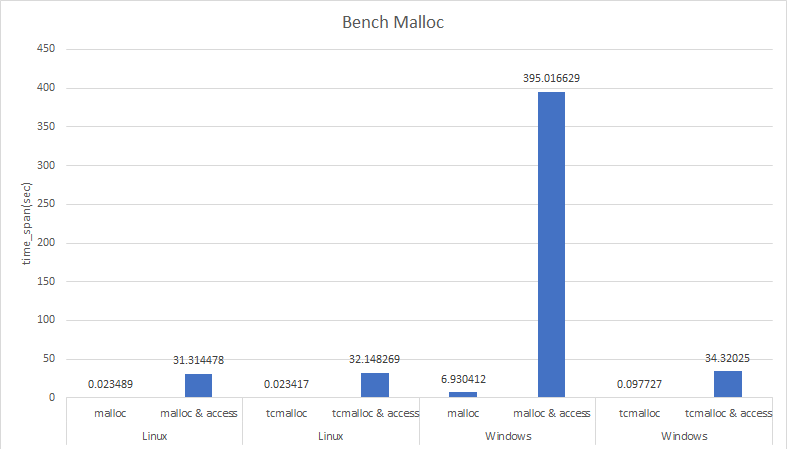

# Benchmark for Malloc

This project shows the performance comparsion between system built-in malloc and [tcmalloc](https://github.com/gperftools/gperftools).

Besides that, it is also shows a example to integrated tcmalloc via CMake build system.

## Bench malloc result

Hardward environment:
```
Notebook: Dell G3 3590
CPU: Intel(R) Core(TM) i7-9750H CPU @ 2.60GHz
RAM: 32GB
```

Software environment:
```
Windows: Windows 10.0.19045
Compiler: Visual Studio 2022

Linux: Linux xu-G3-3590 5.15.0-60-generic #66~20.04.1-Ubuntu SMP Wed Jan 25 09:41:30 UTC 2023 x86_64 x86_64 x86_64 GNU/Linux
Compiler: gcc version 9.4.0

* Note: Windows and Linux is due boot in the same SATA disk.
```

Benchmark code:
```c++
#define COUNT 1000*1000

void bench_malloc_func()
{
	for (size_t i = 0; i < COUNT; ++i)
	{
		int malloc_size = i * sizeof(int);
		int * pInt = (int*)malloc(malloc_size);
		free(pInt);
	}
}

void bench_malloc_and_access_func()
{
	for (size_t i = 0; i < COUNT; ++i)
	{
		int malloc_size = i * sizeof(int);
		int * pInt = (int*)malloc(malloc_size);

		memset(pInt, 0, malloc_size);
		free(pInt);
	}
}
```


Windows built-in malloc consumer a lot of time during this benchmark.

## Build from source
### Get the Source Code
```bash
git clone --recursive https://github.com/xuhancn/bench_malloc
cd bench_malloc
# if you are updating an existing checkout
git submodule sync
git submodule update --init --recursive
```

### Genarate project from cmake
```bash
mkdir build
cd build
cmake ..
```

### Build project
**On Linux**
```bash
make
```

**On Windows**

Need run command in [Visual Studio Developer Command Prompt](https://learn.microsoft.com/en-us/visualstudio/ide/reference/command-prompt-powershell?view=vs-2022)
```bash
msbuild bench_malloc.sln
```